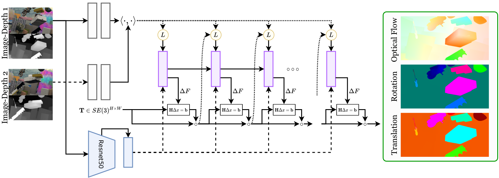

# RAFT-3D: Scene Flow using Rigid-Motion Embeddings

<center></center>

[RAFT-3D: Scene Flow using Rigid-Motion Embeddings](https://arxiv.org/abs/2012.00726)  
Zachary Teed and Jia Deng, CVPR 2021

```
@inproceedings{teed2021raft3d,
  title={RAFT-3D: Scene Flow using Rigid-Motion Embeddings},
  author={Teed, Zachary and Deng, Jia},
  booktitle={Proceedings of the IEEE/CVF Conference on Computer Vision and Pattern Recognition (CVPR)},
  year={2021},
}
```

## Installation
RAFT-3D requires our LieTorch package to be installed. Please see [https://github.com/princeton-vl/lietorch](https://github.com/princeton-vl/lietorch) for instructions (requires PyTorch >= 1.6). All Cuda kernels required for RAFT-3D will automatically be installed with LieTorch.

### Additional Requirements:
* OpenCV
* matplotlib
* tqdm
* Scikit-Sparse (only required for raft3d_laplacian)


## Usage


### Pretrained Models:
* [raft3d.pth](https://drive.google.com/file/d/1Lt14WdzPQIjaOqVLbvNBqdDLtN9wtxbs/view?usp=sharing) : trained on FlyingThings3D
* [raft3d_laplacian.pth](https://drive.google.com/file/d/1sWXkyyqRrRhexv9y8iXK7A0i-1euwEPi/view?usp=sharing) : trained on FlyingThings3D with bi-Laplacian smoothing
* [raft3d_kitti.pth](https://drive.google.com/file/d/1CtUb47xd1o5q4NmkdG2LKVo5wL8uiIRF/view?usp=sharing) : finetuned on KITTI-15 with bi-Laplacian smoothing


### Demo:

You can run the demo to predict a SE3 field from a pair of RGB-D frames

```
python scripts/demo.py --network=raft3d.raft3d --model=raft3d.pth
```
or using the network with bi-Laplacian smoothing

```
python scripts/demo.py --network=raft3d.raft3d_bilaplacian --model=raft3d_laplacian.pth
```

### FlyingThings3D Evaluation:

Evaluation requires the [FlyingThings3D](https://lmb.informatik.uni-freiburg.de/resources/datasets/SceneFlowDatasets.en.html) dataset to be downloaded.  You also need to download the preprocessed FlowNet3D testing data from [things_test_data.pickle](https://drive.google.com/file/d/1zzPAJ-hYlA0eKgzwwuuh3zfS47OXD7su/view?usp=sharing).

Our code expects the following directory structure:
```Shell
├── datasets
    ├── things_test_data.pickle
    ├── FlyingThings3D
        ├── frames_cleanpass
        ├── frames_finalpass
        ├── disparity
        ├── disparity_change
        ├── optical_flow
        ├── camera_data
```

You can then evaluate one of the pretrained models
```
python scripts/evaluation.py --network=raft3d.raft3d --model=raft3d.pth
python scripts/evaluation.py --network=raft3d.raft3d_bilaplacian --model=raft3d_laplacian.pth
```


### KITTI Evaluation:

First download the [KITTI Scene Flow dataset](http://www.cvlibs.net/datasets/kitti/eval_scene_flow.php). You also need to download disparity estimates from GA-Net [disp_ganet_training](https://drive.google.com/file/d/1LGpw2_d17jESAVxcl4ZaeoKisnqDOLlK/view?usp=sharing) and [disp_ganet_testing](https://drive.google.com/file/d/1_rP09NpCKEoxnbPF9_S88FHS6p6u3o6H/view?usp=sharing). Place the GA-Net estimates in the respective training and testing folders such that the directory structure is as follows

```
├── datasets
    ├── KITTI
        ├── devkit
        ├── training
            ├── disp_ganet_training
            ...
        ├── testing
            ├── disp_ganet_testing
            ...
```

You can then run the KITTI submission script

```
python scripts/kitti_submission.py --network=raft3d.raft3d_bilaplacian --model=raft3d_kitti.pth
```


## Training

Training requires a GPU with 24Gb of memory. First download the required datasets for training and evaluation. 

### Training on FlyingThings3D
```
python -u scripts/train_things.py --name=r3d --batch_size=4 --lr=0.0002 --network=raft3d.raft3d_bilaplacian
```

### Finetuning on KITTI
```
python -u scripts/train_kitti.py --name=r3d_kitti --batch_size=4 --lr=0.0001 --network=raft3d.raft3d_bilaplacian --ckpt=checkpoints/r3d_200000.pth
```

You can create a submission to the KITTI benchmark by running
```
python scripts/kitti_submission.py --model=checkpoints/r3d_kitti_050000.pth --network=raft3d.raft3d_bilaplacian
```
